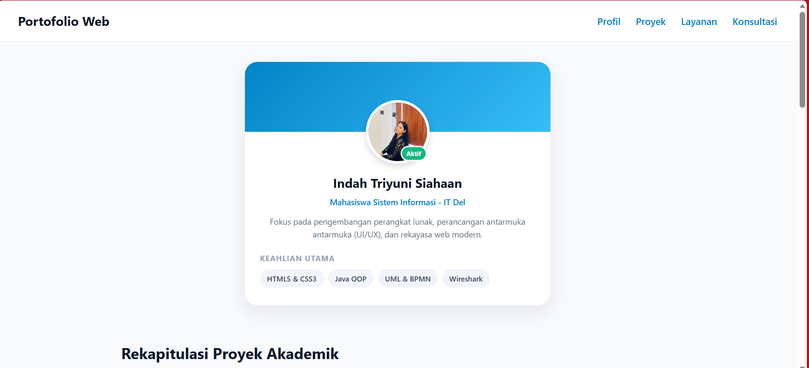
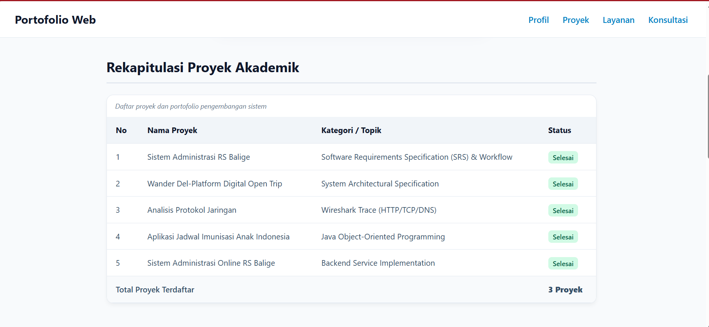
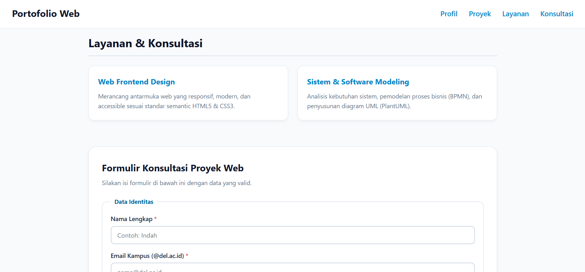
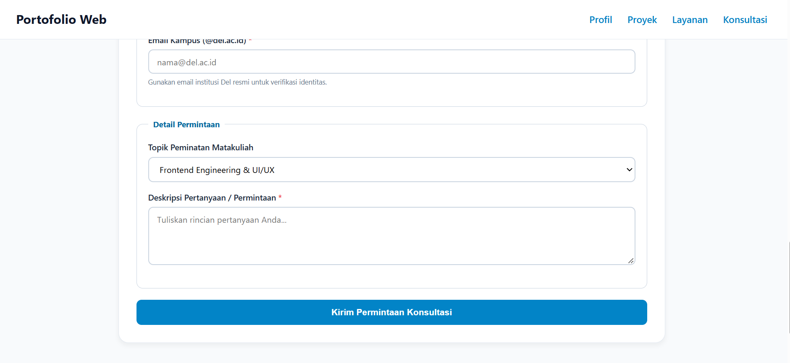

# ppw-2026-week2-12S24052

# Portofolio & Layanan Interaktif – Indah Triyuni Siahaan

## Deskripsi Proyek

Proyek ini merupakan halaman web portofolio profil profesional berbasis **HTML5 dan CSS3** yang dibuat untuk memenuhi tugas praktikum Minggu 02 mata kuliah **Pemrograman dan Pengujian Aplikasi Web (12S3101)**.

Website menampilkan profil akademik, keahlian, rekapitulasi proyek, layanan yang ditawarkan, serta formulir konsultasi proyek web dalam satu halaman (*single page showcase webpage*).

## Tujuan

Tujuan pengembangan website ini adalah:

* Menerapkan struktur dokumen menggunakan HTML5 semantik.
* Menampilkan data proyek menggunakan tabel HTML5.
* Membuat tampilan antarmuka yang rapi dan modern menggunakan CSS3.
* Menerapkan komponen formulir yang terstruktur dan mudah digunakan.
* Menerapkan prinsip dasar aksesibilitas pada formulir.
* Mengembangkan halaman web portofolio yang dapat dipublikasikan melalui GitHub Pages.

## Fitur Website

### 1. Profil

Bagian profil menampilkan:

* Foto profil.
* Nama mahasiswa.
* Status sebagai mahasiswa Sistem Informasi IT Del.
* Deskripsi singkat.
* Daftar keahlian utama.
* Status pengguna "Aktif".

Keahlian yang ditampilkan meliputi:

* HTML5 & CSS3
* Java OOP
* UML & BPMN
* Wireshark

### 2. Rekapitulasi Proyek Akademik

Bagian proyek menggunakan tabel HTML5 untuk menampilkan daftar proyek akademik beserta kategori dan status penyelesaiannya.

Proyek yang ditampilkan meliputi:

1. Sistem Administrasi RS Balige – SRS & Workflow
2. Wander Del – Platform Digital Open Trip – System Architectural Specification
3. Analisis Protokol Jaringan – Wireshark Trace
4. Aplikasi Jadwal Imunisasi Anak Indonesia – Java Object-Oriented Programming
5. Sistem Administrasi Online RS Balige – Backend Service Implementation

Tabel menggunakan elemen semantik seperti `<caption>`, `<thead>`, `<tbody>`, dan `<tfoot>`.

### 3. Layanan & Konsultasi

Website menyediakan dua layanan utama:

* **Web Frontend Design**
  Perancangan antarmuka web yang responsif, modern, dan menggunakan struktur HTML5 semantik.

* **Sistem & Software Modeling**
  Analisis kebutuhan sistem, pemodelan proses bisnis menggunakan BPMN, serta pemodelan sistem menggunakan UML dan PlantUML.

### 4. Formulir Konsultasi

Formulir digunakan sebagai media untuk mengirimkan permintaan konsultasi proyek web.

Formulir terdiri dari:

* Nama lengkap.
* Email kampus.
* Pilihan topik peminatan.
* Deskripsi pertanyaan atau permintaan.
* Validasi input menggunakan atribut `required`.
* `fieldset` dan `legend` untuk mengelompokkan data.
* `label` yang terhubung dengan setiap input.
* `aria-describedby` untuk menghubungkan email dengan teks bantuan.

## Teknologi yang Digunakan

* **HTML5** – digunakan untuk membangun struktur dan konten halaman.
* **CSS3** – digunakan untuk mengatur tampilan, warna, tata letak, tipografi, dan interaksi visual.
* **Visual Studio Code** – digunakan sebagai text editor/IDE.
* **Git** – digunakan untuk pengelolaan versi kode.
* **GitHub** – digunakan sebagai repositori proyek.
* **GitHub Pages** – digunakan untuk publikasi website secara online.

## Struktur Halaman

Struktur utama website terdiri dari:

```text
Portofolio Web
│
├── Profil
│   ├── Foto Profil
│   ├── Identitas
│   ├── Deskripsi
│   └── Keahlian
│
├── Proyek
│   └── Tabel Rekapitulasi Proyek
│
├── Layanan
│   ├── Web Frontend Design
│   └── Sistem & Software Modeling
│
├── Konsultasi
│   └── Formulir Konsultasi Proyek Web
│
└── Footer
```

## Struktur File

```text
project/
│
├── index.html
├── style.css
├── README.md
│
└── IMG/
    └── foto.jpeg
```

### Penjelasan File

| File/Folder     | Keterangan                                         |
| --------------- | -------------------------------------------------- |
| `index.html`    | Halaman utama website                              |
| `style.css`     | File CSS eksternal untuk mengatur tampilan website |
| `README.md`     | Dokumentasi proyek                                 |
| `IMG/foto.jpeg` | Foto profil yang digunakan pada halaman            |

## Penerapan HTML5 Semantik

Website menggunakan beberapa elemen semantik HTML5, yaitu:

* `<header>` untuk bagian navigasi utama.
* `<nav>` untuk menu navigasi.
* `<main>` untuk konten utama.
* `<section>` untuk membagi konten berdasarkan topik.
* `<article>` untuk komponen profil dan layanan.
* `<footer>` untuk bagian penutup halaman.

Penggunaan elemen tersebut membantu membuat struktur halaman lebih terorganisasi dan memiliki makna yang jelas.

## Penerapan CSS

Website menggunakan **external CSS** melalui:

```html
<link rel="stylesheet" href="style.css">
```

Beberapa konsep CSS yang diterapkan antara lain:

* Universal box sizing.
* Flexbox.
* Border radius.
* Box shadow.
* Gradient.
* Hover effect.
* Typography.
* Spacing menggunakan margin dan padding.
* Styling pada tabel, kartu, tombol, dan formulir.

Tampilan menggunakan kombinasi warna dominan putih dan abu-abu dengan warna aksen biru sehingga memberikan tampilan yang sederhana dan modern.

## Aksesibilitas

Beberapa penerapan aksesibilitas pada website meliputi:

* Penggunaan atribut `alt` pada gambar.
* Penggunaan `<label>` yang terhubung dengan input menggunakan atribut `for`.
* Penggunaan `required` untuk validasi input.
* Penggunaan `fieldset` dan `legend` untuk pengelompokan formulir.
* Penggunaan `aria-describedby` pada input email untuk memberikan informasi bantuan tambahan.
* Penggunaan struktur HTML5 semantik agar konten lebih mudah dipahami.

## Cara Menjalankan Proyek

1. Clone atau download repository proyek.
2. Buka folder proyek menggunakan Visual Studio Code.
3. Pastikan file `index.html`, `style.css`, dan folder `IMG` berada pada struktur yang sesuai.
4. Buka file `index.html` menggunakan browser.
5. Website juga dapat dijalankan menggunakan ekstensi **Live Server** pada Visual Studio Code.

## GitHub Repository

Repository proyek:

(https://github.com/IndahSiahaan/ppw-2026-week2-12S24052)

## Identitas

Nama: Indah Triyuni Siahaan
Program Studi: S1 Sistem Informasi
Institut: Institut Teknologi Del
Mata Kuliah:Pemrograman dan Pengujian Aplikasi Web (12S3101)
Tahun: 2026

## Screenshot

Tambahkan screenshot tampilan website pada bagian ini.

## Screenshot

### Tampilan Profil


### Tampilan Proyek dan Layanan


### Tampilan Layanan dan Konsultasi


### Tampilan Formulir



---


